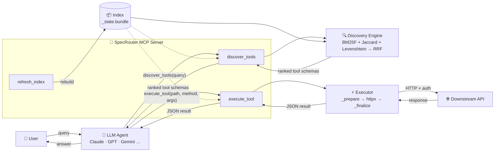

<p align="center">
  
</p>

# SpecRouterMCP 🧭

[](https://www.python.org/downloads/)
[](https://modelcontextprotocol.io)

**SpecRouterMCP** is a high-performance Model Context Protocol (MCP) server that dynamically converts massive OpenAPI/Swagger specifications into executable LLM tools on-the-fly. Lexical discovery engine that turns any OpenAPI/Swagger spec into MCP tools on demand — exposing two generic mcp tools (discover + execute) that use BM25F + fuzzy matching to surface only the top-k relevant endpoints, keeping the LLM's context lean.

A lightning-fast, local CPU-bound search matrix, SpecRouterMCP achieves sub-millisecond route discovery while eliminating context-window bloat.

## 🚀 Two-Tool Lazy Loading

Instead of hardcoding hundreds of API endpoints into the LLM context, SpecRouterMCP exposes exactly two tools:

1. **`discover_tools(query)`** — a local, multi-field lexical + set-based + character-fuzzy search engine
   maps natural-language intent to the best-matching endpoints and returns a top-k array of dynamic tool
   definitions, each with a separate **`inputSchema`** and **`outputSchema`**.
2. **`execute_tool(path, method, arguments)`** — takes the selected route and arguments, maps parameters,
   and executes the authenticated live HTTP transaction, returning the raw JSON payload.

A third admin tool, **`refresh_index()`**, re-fetches the spec and rebuilds the index on demand.

Two optional enhancements layer on top: per-tool **output schemas** (derived from each operation's 2xx
response) and opt-in, build-time **AI-enriched descriptions** that sharpen tool selection without adding any
runtime LLM cost. See [Tool schemas](#tool-schemas-input-and-output) and
[AI-enriched descriptions](#ai-enriched-descriptions-optional-build-time) below.

## 🧠 Retrieval Stack (Zero Vectors)

| Engine | Role |
| --- | --- |
| **BM25F** (fielded BM25) | Weights structural fields (`operationId`, `summary`, `tags`, `path`, params) above verbose `description` text. |
| **Token-Set Jaccard** | Intersection-over-union of unique tokens, immune to phrase-length distortion. |
| **Levenshtein** | Character-level edit distance for typo self-correction (`"usrs biling"` → `users billing`). |
| **Reciprocal Rank Fusion** | Fuses the three engines by rank position (`k=60`), no lossy score normalization. |

BM25F additionally applies **fuzzy term expansion**: each query token is matched against the spec
vocabulary so typos contribute real signal in the high-weight structural fields (so `"usrs biling"` ranks
the billing endpoint *first*, not just within top-k). Fuzzy hits are down-weighted by similarity, scan only
the relevant token-length band, and can be disabled via `SPECROUTER_FUZZY_EXPAND=false`.

All engines are pure stdlib. See **Performance** below for the optional `[fast]` accelerator.

### Why not RAG / embeddings?

Embedding-based retrieval is the default mental model for "semantic search", but for API endpoint discovery it trades real problems for theoretical benefits:

| Caveat | Impact |
| --- | --- |
| **Vector DB required** | Adds a stateful service (Pinecone, Chroma, pgvector, …) to deploy, operate, and scale — breaking the "zero infra" property. |
| **Embedding cost at query time** | Every `discover_tools` call either hits an embedding API (latency + cost) or runs a local model (GPU / warm inference). SpecRouter's retrieval is free after index build — pure in-memory CPU. |
| **Structural fields get diluted** | Embeddings flatten a document into one vector — you can't weight `operationId` (the most precise field) higher than a long `description`. SpecRouter's BM25F applies field-level weights so structural signals dominate. |
| **Exact-match degradation** | If a user types `getUserById` precisely, a vector search may rank semantically-similar operations above the exact match. BM25F scores exact term overlap first. |
| **Full re-embed on spec change** | Adding one endpoint means re-embedding the whole corpus. SpecRouter retokenizes only changed records; enrichment caches per-endpoint hashes. |
| **Spec leaves your infra** | Sending an internal API spec to an embedding endpoint means proprietary routes and parameter names transit a third-party service. SpecRouter never phones home at runtime. |

The one genuine trade-off: embeddings handle deep paraphrase better (`"cancel subscription"` → `DELETE /memberships`). SpecRouter's optional [AI-enriched descriptions](#ai-enriched-descriptions-optional-build-time) close most of that gap by rewriting descriptions into agent-friendly language at index-build time — incurring the LLM cost once, not on every query.



For a detailed flow including the init path and enrichment, see **[docs/ARCHITECTURE.md](docs/ARCHITECTURE.md)**.

## Quickstart (clone & run)

SpecRouter is a standard Python package — use **uv** (recommended) or plain pip/venv.

### Option A — uv (fastest)

```bash
git clone <repo-url> && cd SpecRouter

uv venv                       # create .venv
uv pip install -e ".[fast]"   # install with the rapidfuzz accelerator

cp .env.example .env          # then edit .env and set SPECROUTER_SPEC_URL
uv run specrouter index       # (optional) prebuild + persist the index
uv run specrouter serve       # start the MCP server (stdio)
```

`uv run` auto-activates the project venv, so you don't have to source it manually.

### Option B — pip + venv

```bash
git clone <repo-url> && cd SpecRouter

python -m venv .venv
# Windows:  .venv\Scripts\activate
# macOS/Linux:  source .venv/bin/activate

pip install -e ".[fast]"      # or ".[dev,fast]" to also run the tests

cp .env.example .env          # edit .env and set SPECROUTER_SPEC_URL
specrouter index 
specrouter serve              # start the MCP server (stdio)
```

### Install extras

| Target | Includes |
| --- | --- |
| `pip install -e .` | pure-stdlib, infrastructure-free default |
| `pip install -e ".[fast]"` | + `rapidfuzz` accelerator for the fuzzy stage |
| `pip install -e ".[dev]"` | + `pytest` for the test suite |
| `pip install -e ".[demo]"` | + `fastapi`/`uvicorn` for the local demo catalog API |

### Try it locally (live demo)

Want to see discovery + execution end to end without wiring up a real API? Spin up the bundled
**Acme Product Catalog** — a local FastAPI server with ~100 product endpoints across 10 categories —
point SpecRouter at it, and attach it to Claude Code / VS Code. See **[demo/README.md](demo/README.md)**.

## Configuration

SpecRouter is configured through environment variables (or a `.env` file in the working directory).
**Real environment variables override `.env` values.** Copy the template and edit:

```bash
cp .env.example .env
```

At minimum set `SPECROUTER_SPEC_URL`. For the full variable reference — including auth modes, base URL resolution, fuzzy tuning, output schema, enrichment, and logging — see **[docs/CONFIGURATION.md](docs/CONFIGURATION.md)**.

## Source adapters (not just OpenAPI)

Out of the box SpecRouter ingests an OpenAPI/Swagger spec, but the source is pluggable via
`SPECROUTER_SOURCE_ADAPTER`:

| Value | Ingests |
| --- | --- |
| `openapi` *(default)* | An OpenAPI 3 / Swagger 2 spec (`SPECROUTER_SPEC_URL`). |
| `custom` | A static **HTML doc site**, via a CSS-selector rules file you generate with `specrouter init-rules`. |
| `module:callable` | Your own adapter for any other source. |

Got an API documented as HTML pages instead of a spec? `specrouter init-rules <doc-url>` has an LLM write the
scraper rules for you. **→ See [docs/SOURCE_ADAPTERS.md](docs/SOURCE_ADAPTERS.md)** for the `custom` and
`module:callable` adapters.

## CLI

```bash
specrouter index       # prebuild + persist the index, then exit (the upfront build script)
specrouter serve       # start the MCP server over stdio (builds on demand if no fresh cache)
specrouter refresh     # force a re-fetch + rebuild + persist, out of band
specrouter init-rules <doc-url>   # LLM-generate a custom-adapter rules file (see Source adapters)

# Host it as a network service for remote clients:
specrouter serve --transport streamable-http --host 0.0.0.0 --port 8000
```

## Indexing, persistence & refresh

- **Build upfront *or* at startup.** Run `specrouter index` to pre-warm the on-disk index, or just
  `specrouter serve` and it builds in-memory on first boot. Both go through one shared `ensure_index` path.
- **Persisted & hash-keyed.** The index is pickled to `SPECROUTER_CACHE_DIR`, keyed by the spec URL, with a
  JSON `meta` sidecar (`source_hash`, `etag`, `last_modified`, `built_at`, `endpoint_count`).
- **Auto-refresh on change.** On startup a cheap HTTP `HEAD` probe compares `ETag`/`Last-Modified`; if the
  server offers no validators, the body is fetched and compared by SHA-256 content hash. The index is rebuilt
  **only when the spec actually changed.**
- **Manual refresh.** Call the `refresh_index` MCP tool or run `specrouter refresh` to force a rebuild.

## Logging

SpecRouter writes a single **rotating log file** (`./logs/specrouter.log` by default) covering every step:
indexing, enrichment progress, each `discover_tools` call, and every executed route with its **FQDN +
arguments + response code**. It's configured automatically for every CLI command and the server — no setup.
Logs go to a file (and optionally stderr), **never stdout**, so the MCP stdio protocol stays clean. Auth
secrets are never logged.

**→ See [docs/LOGGING.md](docs/LOGGING.md)** for the full event list, log levels, rotation, and the
`SPECROUTER_LOG_*` settings.

## Performance: the optional `[fast]` accelerator

Of the three engines, only **Levenshtein** is genuinely `O(N·m·n)` and becomes the bottleneck as endpoint
counts climb toward the thousands. BM25F, Jaccard, and RRF are already trivially fast in pure Python at this
scale, so they stay stdlib regardless.

Installing the `[fast]` extra (`rapidfuzz`) transparently routes the fuzzy stage through a compiled
batch distance implementation. **Results are identical** to the stdlib path — a parity test enforces this.
The default install stays pure-stdlib so the "infrastructure-free, offline, no binary dependencies" promise
holds out of the box.

### Measured `discover_tools` latency

Added cost of **fuzzy term expansion** over the exact-match baseline (single CPU core):

| Spec size | Vocab | stdlib (added) | rapidfuzz `[fast]` (added) |
| --- | --- | --- | --- |
| ~50 endpoints | ~300 | ~2–3 ms | <1 ms |
| ~500 endpoints | ~2.5K | ~15–20 ms | ~2–3 ms |
| ~2000 endpoints | ~10K | ~50–85 ms | ~1–10 ms |

For small/medium specs, fuzzy expansion is cheap on pure stdlib. For large specs (thousands of endpoints)
install `[fast]` to keep it in single-digit milliseconds, or disable expansion with
`SPECROUTER_FUZZY_EXPAND=false`. Even the worst case stays well under typical LLM round-trip latency.

## Tool schemas: input **and** output

Each tool returned by `discover_tools` carries a separate, MCP-native `inputSchema` and `outputSchema`.
The `outputSchema` is derived from the operation's primary success (2xx) JSON response, with `$ref`s inlined
up to `SPECROUTER_OUTPUT_SCHEMA_MAX_DEPTH` (default 4) so the client LLM knows what `execute_tool` returns
without re-introducing context bloat. Disable with `SPECROUTER_INCLUDE_OUTPUT_SCHEMA=false`.

```jsonc
{
  "name": "get_v1_users_id_billing",
  "description": "[TAGS: Finance] … Path: GET /v1/users/{id}/billing",
  "inputSchema":  { "type": "object", "properties": { "id": { … } }, "required": ["id"] },
  "outputSchema": { "type": "object", "properties": { "invoices": { "type": "array", … } } }
}
```

## AI-enriched descriptions (optional, build-time)

SpecRouter can rewrite endpoint descriptions with an LLM at index-build time, sharpening tool selection
without adding any runtime cost. This is opt-in, per-endpoint cached, and zero-ML at runtime.

For provider extras, env variables, and a usage example, see **[docs/CONFIGURATION.md — AI-enriched descriptions](docs/CONFIGURATION.md#ai-enriched-descriptions-optional-build-time)**.

## Run as an MCP server

An MCP server over stdio is **not a long-running daemon you visit in a browser** — the MCP client
(Claude Desktop, Claude Code, etc.) launches it as a subprocess and talks to it over stdin/stdout. So you
normally don't run `serve` by hand; you point your client's config at the `specrouter serve` command and the
client starts/stops it for you. Running `specrouter serve` in a terminal directly is only useful for manual
testing (it will sit waiting for MCP protocol messages on stdin).

### 1. Verify it works standalone (optional)

```bash
specrouter index     # parses the spec and prints the endpoint count + cache path
```

Or inspect the tools live with the [MCP Inspector](https://github.com/modelcontextprotocol/inspector)
(needs Node/`npx`). Set `SPECROUTER_SPEC_URL` first (env or `.env`):

```bash
# Recommended — runs the real CLI entrypoint (full init), connects the Inspector over stdio:
npx @modelcontextprotocol/inspector specrouter serve

# Or via the MCP dev tool (needs the CLI extras: pip install -e ".[dev]"). Point it at the
# bundled launcher shim, NOT a command string:
mcp dev dev_server.py
```

> Two gotchas with `mcp dev`: it expects a Python **file**, not a command (`mcp dev "specrouter serve"`
> fails), and it imports that file standalone — which breaks package-relative imports. The repo ships a tiny
> `dev_server.py` shim that absolute-imports the server so `mcp dev dev_server.py` works.

### 2. Register with an MCP client (local, stdio)

**Claude Code:**

```bash
claude mcp add specrouter -- specrouter serve
```

(set the env vars in your shell or a `.env` first, or pass `-e KEY=value` flags).

**Claude Desktop / generic `mcpServers` config** — installed console script:

```json
{
  "mcpServers": {
    "specrouter": {
      "command": "specrouter",
      "args": ["serve"],
      "env": {
        "SPECROUTER_SPEC_URL": "https://api.example.com/openapi.json",
        "SPECROUTER_AUTH_MODE": "bearer",
        "SPECROUTER_BEARER_TOKEN": "..."
      }
    }
  }
}
```

**Using uv from a cloned checkout** (no global install needed):

```json
{
  "mcpServers": {
    "specrouter": {
      "command": "uv",
      "args": ["run", "--directory", "/absolute/path/to/SpecRouter", "specrouter", "serve"],
      "env": {
        "SPECROUTER_SPEC_URL": "https://api.example.com/openapi.json"
      }
    }
  }
}
```

> The `env` block in client config and a local `.env` file both work; the client's `env` values take
> precedence. If you omit `env` entirely, SpecRouter falls back to the `.env` in its working directory.

## Remote hosting (one shared server, many clients)

Instead of each user launching a local subprocess, you can run SpecRouter once on a host/VM/container and
have clients connect over HTTP. Use the **streamable-http** transport (recommended) or **sse**.

### On the server

```bash
# Install, configure, and start (set SPECROUTER_* via env or a .env in the working dir)
export SPECROUTER_SPEC_URL="https://api.example.com/openapi.json"
export SPECROUTER_AUTH_MODE="bearer"
export SPECROUTER_BEARER_TOKEN="..."

specrouter index    # optional: prebuild the cache
specrouter serve --transport streamable-http --host 0.0.0.0 --port 8000
```

The MCP endpoint is then `http://<host>:8000/mcp` (streamable-http) or `http://<host>:8000/sse` (sse).
Run it under a process manager (systemd, Docker, supervisor) and, for anything beyond localhost, **front it
with HTTPS + auth** (see the security note below).

Example `Dockerfile` (copies only the package, not your local `.venv`):

```dockerfile
FROM python:3.12-slim
WORKDIR /app
COPY pyproject.toml README.md ./
COPY src ./src
RUN pip install --no-cache-dir ".[fast]"
EXPOSE 8000
# Provide config at run time, e.g.:
#   docker run -p 8000:8000 -e SPECROUTER_SPEC_URL=https://api.example.com/openapi.json <image>
CMD ["specrouter", "serve", "--transport", "streamable-http", "--host", "0.0.0.0", "--port", "8000"]
```

### On each client — `mcp.json` / `mcpServers`

Clients that support remote MCP (HTTP) connect by **URL**, no local install:

```json
{
  "mcpServers": {
    "specrouter": {
      "type": "http",
      "url": "https://specrouter.your-domain.com/mcp"
    }
  }
}
```

If you put an auth proxy in front, pass a header:

```json
{
  "mcpServers": {
    "specrouter": {
      "type": "http",
      "url": "https://specrouter.your-domain.com/mcp",
      "headers": { "Authorization": "Bearer <client-token>" }
    }
  }
}
```

Add it to Claude Code with:

```bash
claude mcp add --transport http specrouter https://specrouter.your-domain.com/mcp
```

**Stdio-only clients** (some older clients can't speak HTTP directly) can bridge via
[`mcp-remote`](https://www.npmjs.com/package/mcp-remote):

```json
{
  "mcpServers": {
    "specrouter": {
      "command": "npx",
      "args": ["-y", "mcp-remote", "https://specrouter.your-domain.com/mcp"]
    }
  }
}
```

### ⚠️ Security note for hosted deployments

`execute_tool` makes **live, authenticated calls** to your downstream API using the server's configured
credentials. Anyone who can reach the MCP endpoint can invoke those calls. When hosting beyond localhost:

- Terminate **HTTPS** and require authentication at a reverse proxy (the `headers` block above), or restrict
  network access (VPC / firewall / private network).
- Treat the host's `SPECROUTER_*` auth credentials as secrets (env/secret manager, not committed).
- Consider a least-privilege downstream token, since every connected client shares the server's identity.

`execute_tool` follows redirects but **drops injected credential headers** (the api-key header and
`SPECROUTER_EXTRA_HEADERS`) whenever a downstream redirects to a different origin, so a misbehaving API can't
bounce your secrets to another host. The on-disk index cache is a pickle written by the server — keep
`SPECROUTER_CACHE_DIR` owner-writable (not a shared/world-writable path).

## Tests

```bash
pytest
```

Covers tokenizer normalization, each engine, parser `$ref` resolution, end-to-end discovery (including the
typo case), executor parameter routing, all auth modes (httpx mocked), output-schema extraction/inlining, and
description enrichment (with a fake LLM — no network or provider deps). The stdlib/rapidfuzz parity test is
skipped automatically when `rapidfuzz` is not installed.

## Demo

https://github.com/user-attachments/assets/0a85342d-b90e-4640-8cd7-1e05378f19ed

## Author

Prabhukiran Ganapavarapu — [github.com/prabhukirangit](https://github.com/prabhukirangit)
