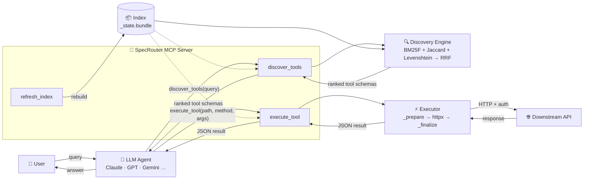
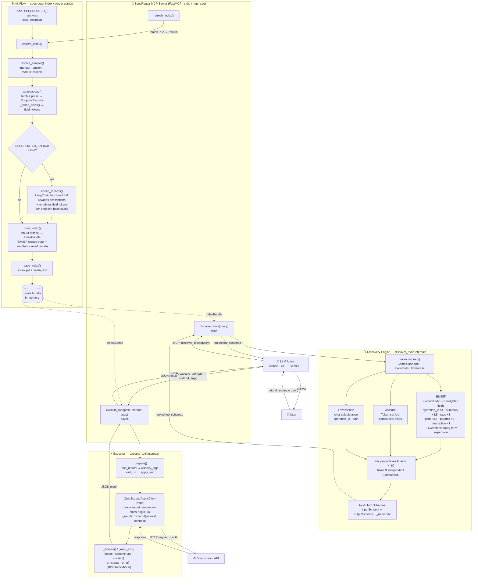

# SpecRouter — Architecture

## Quick overview

## Detailed flow

SpecRouter operates in two phases: an **init flow** that builds and persists the search index (once, at startup or on demand), and a **runtime flow** where the LLM agent calls `discover_tools` to find relevant endpoints and `execute_tool` to call them live.

## Key design notes

**Init is one-shot.** `ensure_index` is the single entry point for CLI prebuild, server startup, and `refresh_index` — nothing else touches the build path. The enrichment LLM runs here and only here; the runtime stays zero-ML.

**Three engines, one fused rank.** BM25F, Jaccard, and Levenshtein produce three independent ranked lists. RRF fuses them by rank position (not raw score), which avoids lossy score normalization and is robust to one engine returning a weak signal.

**BM25F field weights favour structure over prose.** `operation_id` (×4) and `summary` (×3.5) outweigh `description` (×1) because structural identifiers are stable and precise. Fuzzy term expansion via a length-bucketed vocab scan means typos like `"usrs biling"` rank the right endpoint first.

**Executor never blocks the event loop.** `execute_tool` is `async` — it awaits `execute_to_json_async` which uses `httpx.AsyncClient`. `discover_tools` and `refresh_index` stay sync (pure CPU). `_CredScopedAsyncClient` follows redirects but strips the api-key and extra headers on cross-origin hops (httpx only strips `Authorization`/`Cookie` by default).

**Source adapters are hot-swappable.** The adapter (`openapi`, `custom`, `module:callable`) runs only during the init flow and yields standard `EndpointRecord`s; the discovery and executor layers never know which adapter was used.
